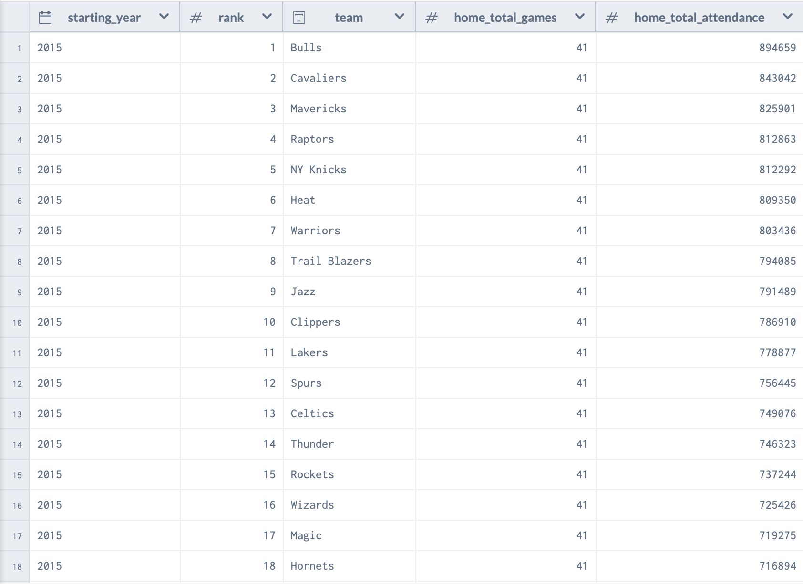
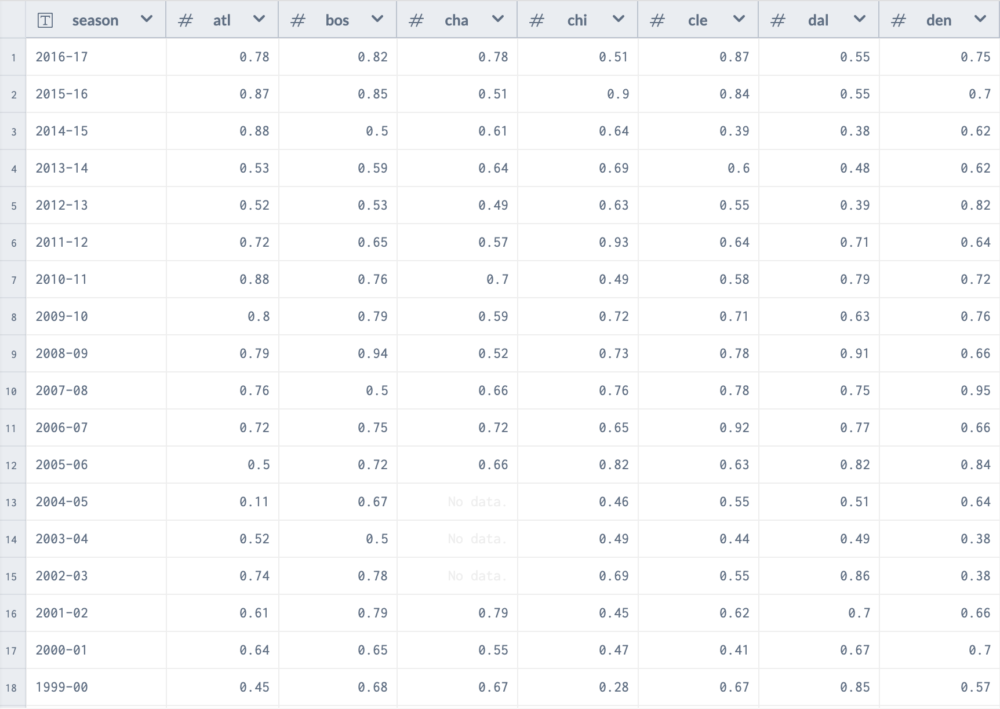

# Sports Analytics

## Project: Basketball Analysis

## Team Member Names
* Jordan Jones - jmj243@uw.edu
* Justin Lim - limj27@uw.edu
* Hannan Ajmal - hajmal05@uw.edu

Info-201: Technical Foundations of Informatics  
The Information School  
University of Washington  
Autumn 2019

## Introduction
1. **Problem Situation** - The stakeholders of the problem situation are the players and managers. The setting of the problem is the professional basketball industry. Analyzing data and how well each player/team is doing is valued by everyone in the industry. Using the data from sports analytics causes some ethics problems due to people using this data for betting on sports and profit purposes.

2. **What is the Problem?** - Sports teams are financially challenged due to poor performance by both the players, coaches and the team overall. If teams are not performing well, sales, revenue, and fan support decrease. This causes organizational and front office failure that is detrimental to the survival of a team. Ultimately, when teams are not doing well, it is a lose-lose situation for everyone that is involved.

3. **Why Does the Problem Matter?** - The problem matters because sports is a beloved thing in the United States of America. There are a plethora of stakeholders that are invested into the sport of basketball and are negatively affected when their team is underperforming. A lot of people use sports as their motivation, hobby, pass time, escape and underperforming teams prohibit them from the enjoyment that the sport was intended to bring.

4. **How will it be addressed?** - We will address this problem by analyzing player data from a recently completed National Basketball Association season. We will analyze over one underperforming team (An NBA team that missed out on the playoffs due to a bad record) to find what they need to improve on in order to meet the standards of their fans and the stakeholders of the NBA.

## Research Questions
1. What is the team's overall stat averages in the main NBA stat categories in comparison to the averages of the entire NBA?

2. How do the stats that were analyzed correlate to fan attendance?

## Possible Data Sets
1. https://data.world/gmoney/nba-team-annual-attendance - There are 476 observations and 11 observations in the NBA Team Annual Attendance dataset. This dataset provides statistics about the fan attendance at home games for every NBA team.

2. https://www.kaggle.com/noahgift/social-power-nba - There are 100 observations and 63 attributes in the Social Power NBA dataset. This dataset provides information about player stats for the most important NBA stats and the averages of all of the columns.

## Information Visualizations

This photo shows the total attendance of each NBA team from 2015 onwards and ranks each team by their fan attendance statistics. This allows us to see the consistency of the fan attendance in comparison to how the teams did each year.

This photo shows the continuity of every NBA team from the 2017 Season and before. This allows us to see the overall stability of every NBA organization over time and how it coincides with the fan attendance.

## Team Work Commitments
1. Tuesdays 6-8pm

2. Our goal is to finish the project and meet all of the requirements. We do not have any set roles, we share all tasks.

3. We will communicate by text.

4. We will discuss in person what we believe is going well and not so well when we are working on each portion of the project.

## References
1. https://data.world/gmoney/nba-team-annual-attendance

2. https://www.kaggle.com/noahgift/social-power-nba

3. https://data.world/gmoney/nba-team-continuity-52-16/workspace/file?filename=Team+Continuity.xlsx
